# nano-vLLM 架构速学知识文档

> 来源目录：`/Users/MacBook/Desktop/nano_vllm_note`  
> 目标：快速理解这个 mini vLLM 推理框架，能手撕主链路、调度器、KV cache 管理和模型执行边界。  
> 说明：本文件基于静态代码审核生成，重点讲架构和工程关系，代码细节只保留到能定位源码的程度。

## 1. 一句话抓住这个项目

这个 `nano_vllm` 是一个小型推理引擎：外部用户调用 `LLM(...).generate(...)`，内部把请求变成 `Sequence`，由 `Scheduler` 在 `waiting/running` 队列之间调度，再由 `ModelRunner` 执行 prefill 或 decode，Attention 层把 K/V 写入按 block 管理的 KV cache，最后采样下一个 token 并回收结束请求的缓存块。

它最值得学的不是 Qwen3 模型结构本身，而是这条工程主线：

```text
请求进入 -> 请求状态对象 -> 调度 -> KV block 分配 -> prefill/decode 输入准备
       -> 模型前向 -> 写 KV cache -> 采样 -> 状态更新/释放资源 -> 循环
```

## 2. 一图看懂

<div align="center">

<svg style="max-width: 100%; height: auto;" xmlns="http://www.w3.org/2000/svg" width="1600" height="900" viewBox="0 0 1600 900">
<defs>
  <filter id="paperNoise" x="-5%" y="-5%" width="110%" height="110%">
    <feTurbulence type="fractalNoise" baseFrequency="0.028" numOctaves="4" seed="8" result="noise"/>
    <feColorMatrix type="matrix" values="0.12 0 0 0 0.88  0 0.10 0 0 0.82  0 0 0.08 0 0.68  0 0 0 0.20 0" />
  </filter>
  <filter id="roughen" x="-3%" y="-3%" width="106%" height="106%">
    <feTurbulence type="fractalNoise" baseFrequency="0.018" numOctaves="2" seed="3" result="noise"/>
    <feDisplacementMap in="SourceGraphic" in2="noise" scale="1.1" xChannelSelector="R" yChannelSelector="G"/>
  </filter>
  <style>
    .rough { filter: url(#roughen); }
    text { paint-order: stroke; stroke: rgba(247,240,223,0.28); stroke-width: 1px; stroke-linejoin: round; }
  </style>
</defs>
<rect width="100%" height="100%" fill="#F7F0DF"/>
<rect width="100%" height="100%" filter="url(#paperNoise)" opacity="0.35"/>
<text x="800.0" y="76.0" font-family="'Kaiti SC','STKaiti','Xingkai SC','Comic Sans MS',sans-serif" font-size="54" font-weight="600" fill="#111111" text-anchor="middle" dominant-baseline="middle"><tspan x="800.0" dy="0.0">nano-vLLM Inference Architecture</tspan></text><rect class="rough" x="58.0" y="152.0" width="505.0" height="472.0" rx="34.0" fill="#DCECF7" stroke="#8BB7D8" stroke-width="3" /><rect class="rough" x="199.4" y="124.0" width="170.0" height="60.0" rx="12.0" fill="#F7F0DF" stroke="#8BB7D8" stroke-width="3" /><text x="284.4" y="155.0" font-family="'Kaiti SC','STKaiti','Xingkai SC','Comic Sans MS',sans-serif" font-size="38" font-weight="500" fill="#111111" text-anchor="middle" dominant-baseline="middle"><tspan x="284.4" dy="0.0">请求入口</tspan></text><path class="rough" d="M 120.5 419.5 C 98.0 367.0, 173.0 347.0, 188.0 367.0 C 208.0 312.0, 273.0 352.0, 253.0 397.0 C 310.5 397.0, 310.5 449.5, 263.0 449.5 L 143.0 449.5 C 130.5 447.0, 123.0 437.0, 120.5 419.5" fill="#FFFFFF" stroke="#111111" stroke-width="2.5" stroke-linecap="round" stroke-linejoin="round" /><text x="203.0" y="414.5" font-family="'Kaiti SC','STKaiti','Xingkai SC','Comic Sans MS',sans-serif" font-size="50" font-weight="500" fill="#111111" text-anchor="middle" dominant-baseline="middle"><tspan x="203.0" dy="0.0">API</tspan></text><circle cx="323.0" cy="232.1" r="7.4" fill="#FFFFFF" stroke="#111111" stroke-width="3"/><line class="rough" x1="322.3" y1="239.4" x2="323.6" y2="258.9" stroke="#111111" stroke-width="3" stroke-linecap="round" /><line class="rough" x1="323.1" y1="246.5" x2="310.1" y2="254.5" stroke="#111111" stroke-width="3" stroke-linecap="round" /><line class="rough" x1="321.1" y1="246.7" x2="334.9" y2="239.2" stroke="#111111" stroke-width="3" stroke-linecap="round" /><line class="rough" x1="322.7" y1="261.9" x2="312.2" y2="272.6" stroke="#111111" stroke-width="3" stroke-linecap="round" /><line class="rough" x1="323.5" y1="262.4" x2="333.2" y2="273.2" stroke="#111111" stroke-width="3" stroke-linecap="round" /><text x="393.0" y="247.0" font-family="'Kaiti SC','STKaiti','Xingkai SC','Comic Sans MS',sans-serif" font-size="34" font-weight="500" fill="#111111" text-anchor="start" dominant-baseline="middle"><tspan x="393.0" dy="0.0">prompts</tspan></text><line class="rough" x1="289.9" y1="286.7" x2="509.4" y2="287.7" stroke="#8BB7D8" stroke-width="2" stroke-linecap="round" /><line class="rough" x1="337.1" y1="328.5" x2="345.8" y2="331.3" stroke="#111111" stroke-width="4" stroke-linecap="round" /><line class="rough" x1="332.7" y1="341.3" x2="340.2" y2="346.1" stroke="#111111" stroke-width="4" stroke-linecap="round" /><line class="rough" x1="323.2" y1="343.8" x2="321.2" y2="352.4" stroke="#111111" stroke-width="4" stroke-linecap="round" /><line class="rough" x1="312.8" y1="340.7" x2="305.6" y2="347.0" stroke="#111111" stroke-width="4" stroke-linecap="round" /><line class="rough" x1="307.3" y1="329.2" x2="300.6" y2="330.8" stroke="#111111" stroke-width="4" stroke-linecap="round" /><line class="rough" x1="311.0" y1="319.3" x2="306.4" y2="314.8" stroke="#111111" stroke-width="4" stroke-linecap="round" /><line class="rough" x1="323.9" y1="313.7" x2="324.9" y2="304.9" stroke="#111111" stroke-width="4" stroke-linecap="round" /><line class="rough" x1="333.6" y1="320.1" x2="338.3" y2="313.3" stroke="#111111" stroke-width="4" stroke-linecap="round" /><circle class="rough" cx="323.0" cy="330.0" r="18.6" fill="#FFFFFF" stroke="#111111" stroke-width="3"/><circle cx="323.0" cy="330.0" r="7.4" fill="#F7F0DF" stroke="#111111" stroke-width="3"/><text x="393.0" y="310.3" font-family="'Kaiti SC','STKaiti','Xingkai SC','Comic Sans MS',sans-serif" font-size="34" font-weight="500" fill="#111111" text-anchor="start" dominant-baseline="middle"><tspan x="393.0" dy="0.0">SamplingParam</tspan><tspan x="393.0" dy="39.4">s</tspan></text><line class="rough" x1="286.2" y1="372.2" x2="509.1" y2="371.8" stroke="#8BB7D8" stroke-width="2" stroke-linecap="round" /><path class="rough" d="M 323.0 389.4 L 341.6 400.0 L 323.0 411.1 L 304.4 400.0 Z" fill="#FFFFFF" stroke="#111111" stroke-width="2.5" stroke-linecap="round" stroke-linejoin="round" /><path class="rough" d="M 323.0 397.5 L 341.6 408.0 L 323.0 419.2 L 304.4 408.0 Z" fill="#FFFFFF" stroke="#111111" stroke-width="2.5" stroke-linecap="round" stroke-linejoin="round" /><path class="rough" d="M 323.0 405.6 L 341.6 416.1 L 323.0 427.3 L 304.4 416.1 Z" fill="#FFFFFF" stroke="#111111" stroke-width="2.5" stroke-linecap="round" stroke-linejoin="round" /><text x="393.0" y="413.0" font-family="'Kaiti SC','STKaiti','Xingkai SC','Comic Sans MS',sans-serif" font-size="34" font-weight="500" fill="#111111" text-anchor="start" dominant-baseline="middle"><tspan x="393.0" dy="0.0">LLMEngine</tspan></text><line class="rough" x1="289.5" y1="453.8" x2="508.8" y2="454.9" stroke="#8BB7D8" stroke-width="2" stroke-linecap="round" /><path class="" d="M 301.3 509.6 C 318.0 484.8, 329.2 512.1, 344.7 483.6" fill="none" stroke="#111111" stroke-width="3" stroke-linecap="round" stroke-linejoin="round" /><text x="298.2" y="513.4" font-family="'Kaiti SC','STKaiti','Xingkai SC','Comic Sans MS',sans-serif" font-size="17" font-weight="500" fill="#111111" text-anchor="middle" dominant-baseline="middle"><tspan x="298.2" dy="0.0">×</tspan></text><text x="346.6" y="481.1" font-family="'Kaiti SC','STKaiti','Xingkai SC','Comic Sans MS',sans-serif" font-size="17" font-weight="500" fill="#111111" text-anchor="middle" dominant-baseline="middle"><tspan x="346.6" dy="0.0">×</tspan></text><text x="393.0" y="496.0" font-family="'Kaiti SC','STKaiti','Xingkai SC','Comic Sans MS',sans-serif" font-size="34" font-weight="500" fill="#111111" text-anchor="start" dominant-baseline="middle"><tspan x="393.0" dy="0.0">Sequence</tspan></text><path class="" d="M 662.2 242.4 C 686.0 207.2, 701.8 245.9, 723.8 205.4" fill="none" stroke="#111111" stroke-width="3" stroke-linecap="round" stroke-linejoin="round" /><text x="657.8" y="247.6" font-family="'Kaiti SC','STKaiti','Xingkai SC','Comic Sans MS',sans-serif" font-size="24" font-weight="500" fill="#111111" text-anchor="middle" dominant-baseline="middle"><tspan x="657.8" dy="0.0">×</tspan></text><text x="726.4" y="201.9" font-family="'Kaiti SC','STKaiti','Xingkai SC','Comic Sans MS',sans-serif" font-size="24" font-weight="500" fill="#111111" text-anchor="middle" dominant-baseline="middle"><tspan x="726.4" dy="0.0">×</tspan></text><text x="693.0" y="297.0" font-family="'Kaiti SC','STKaiti','Xingkai SC','Comic Sans MS',sans-serif" font-size="32" font-weight="500" fill="#111111" text-anchor="middle" dominant-baseline="middle"><tspan x="693.0" dy="0.0">waiting/run…</tspan></text><rect class="rough" x="866.3" y="206.3" width="15.0" height="15.0" rx="0.0" fill="#CBE5CE" stroke="#111111" stroke-width="2" /><rect class="rough" x="883.0" y="206.3" width="15.0" height="15.0" rx="0.0" fill="#CBE5CE" stroke="#111111" stroke-width="2" /><rect class="rough" x="866.3" y="223.0" width="15.0" height="15.0" rx="0.0" fill="#CBE5CE" stroke="#111111" stroke-width="2" /><rect class="rough" x="883.0" y="223.0" width="15.0" height="15.0" rx="0.0" fill="#CBE5CE" stroke="#111111" stroke-width="2" /><text x="883.0" y="297.0" font-family="'Kaiti SC','STKaiti','Xingkai SC','Comic Sans MS',sans-serif" font-size="32" font-weight="500" fill="#111111" text-anchor="middle" dominant-baseline="middle"><tspan x="883.0" dy="0.0">block_table</tspan></text><rect class="rough" x="663.1" y="528.0" width="13.9" height="13.9" rx="0.0" fill="#A8B8D7" stroke="#111111" stroke-width="2" /><rect class="rough" x="678.0" y="528.0" width="13.9" height="13.9" rx="0.0" fill="#F4E4A7" stroke="#111111" stroke-width="2" /><rect class="rough" x="693.0" y="528.0" width="13.9" height="13.9" rx="0.0" fill="#D8C4EB" stroke="#111111" stroke-width="2" /><rect class="rough" x="708.0" y="528.0" width="13.9" height="13.9" rx="0.0" fill="#FFFFFF" stroke="#111111" stroke-width="2" /><rect class="rough" x="663.1" y="543.0" width="13.9" height="13.9" rx="0.0" fill="#A8B8D7" stroke="#111111" stroke-width="2" /><rect class="rough" x="678.0" y="543.0" width="13.9" height="13.9" rx="0.0" fill="#FFFFFF" stroke="#111111" stroke-width="2" /><rect class="rough" x="693.0" y="543.0" width="13.9" height="13.9" rx="0.0" fill="#A8B8D7" stroke="#111111" stroke-width="2" /><rect class="rough" x="708.0" y="543.0" width="13.9" height="13.9" rx="0.0" fill="#D8C4EB" stroke="#111111" stroke-width="2" /><text x="693.0" y="617.0" font-family="'Kaiti SC','STKaiti','Xingkai SC','Comic Sans MS',sans-serif" font-size="32" font-weight="500" fill="#111111" text-anchor="middle" dominant-baseline="middle"><tspan x="693.0" dy="0.0">Paged KV</tspan></text><line class="rough" x1="853.4" y1="567.5" x2="915.2" y2="569.4" stroke="#111111" stroke-width="3" stroke-linecap="round" /><line class="rough" x1="853.0" y1="568.3" x2="851.3" y2="519.2" stroke="#111111" stroke-width="3" stroke-linecap="round" /><path class="rough" d="M 861.0 550.0 C 872.4 523.6, 883.0 560.6, 895.3 536.0 S 912.0 541.2, 916.4 527.2" fill="none" stroke="#111111" stroke-width="3" stroke-linecap="round" stroke-linejoin="round" /><text x="883.0" y="617.0" font-family="'Kaiti SC','STKaiti','Xingkai SC','Comic Sans MS',sans-serif" font-size="32" font-weight="500" fill="#111111" text-anchor="middle" dominant-baseline="middle"><tspan x="883.0" dy="0.0">prefill/dec…</tspan></text><path class="rough" d="M 593.0 366.2 L 857.7 366.2 L 857.7 335.6 L 988.0 390.0 L 857.7 444.4 L 857.7 413.8 L 593.0 413.8 Z" fill="rgba(233,90,36,0.03)" stroke="#E95A24" stroke-width="5" stroke-linecap="round" stroke-linejoin="round" /><path class="" d="M 593.0 366.2 L 857.7 366.2 L 857.7 335.6 L 988.0 390.0 L 857.7 444.4 L 857.7 413.8 L 593.0 413.8" fill="none" stroke="#E95A24" stroke-width="2.5" stroke-linecap="round" stroke-linejoin="round" /><text x="758.9" y="393.4" font-family="'Kaiti SC','STKaiti','Xingkai SC','Comic Sans MS',sans-serif" font-size="46" font-weight="600" fill="#E95A24" text-anchor="middle" dominant-baseline="middle"><tspan x="758.9" dy="0.0">调度与KV块管理</tspan></text><rect class="rough" x="1035.0" y="152.0" width="505.0" height="472.0" rx="34.0" fill="#DDF0E4" stroke="#87BFA1" stroke-width="3" /><rect class="rough" x="1176.4" y="124.0" width="170.0" height="60.0" rx="12.0" fill="#F7F0DF" stroke="#87BFA1" stroke-width="3" /><text x="1261.4" y="155.0" font-family="'Kaiti SC','STKaiti','Xingkai SC','Comic Sans MS',sans-serif" font-size="38" font-weight="500" fill="#111111" text-anchor="middle" dominant-baseline="middle"><tspan x="1261.4" dy="0.0">模型执行</tspan></text><rect class="rough" x="1132.8" y="244.8" width="134.4" height="134.4" rx="8.0" fill="#EFEFE7" stroke="#111111" stroke-width="3" /><text x="1200.0" y="313.0" font-family="'Kaiti SC','STKaiti','Xingkai SC','Comic Sans MS',sans-serif" font-size="48" font-weight="500" fill="#111111" text-anchor="middle" dominant-baseline="middle"><tspan x="1200.0" dy="0.0">GPU</tspan></text><line class="rough" x1="1114.2" y1="258.8" x2="1134.1" y2="255.9" stroke="#111111" stroke-width="2" stroke-linecap="round" /><line class="rough" x1="1266.7" y1="257.5" x2="1284.5" y2="256.6" stroke="#111111" stroke-width="2" stroke-linecap="round" /><line class="rough" x1="1143.5" y1="224.1" x2="1143.0" y2="245.9" stroke="#111111" stroke-width="2" stroke-linecap="round" /><line class="rough" x1="1143.3" y1="378.2" x2="1144.4" y2="399.9" stroke="#111111" stroke-width="2" stroke-linecap="round" /><line class="rough" x1="1111.9" y1="284.2" x2="1133.0" y2="285.9" stroke="#111111" stroke-width="2" stroke-linecap="round" /><line class="rough" x1="1268.5" y1="285.9" x2="1285.5" y2="284.1" stroke="#111111" stroke-width="2" stroke-linecap="round" /><line class="rough" x1="1171.8" y1="227.1" x2="1174.2" y2="243.4" stroke="#111111" stroke-width="2" stroke-linecap="round" /><line class="rough" x1="1171.1" y1="378.1" x2="1171.3" y2="398.3" stroke="#111111" stroke-width="2" stroke-linecap="round" /><line class="rough" x1="1114.0" y1="311.1" x2="1130.8" y2="311.7" stroke="#111111" stroke-width="2" stroke-linecap="round" /><line class="rough" x1="1266.7" y1="312.3" x2="1288.2" y2="312.8" stroke="#111111" stroke-width="2" stroke-linecap="round" /><line class="rough" x1="1200.1" y1="226.1" x2="1200.7" y2="243.0" stroke="#111111" stroke-width="2" stroke-linecap="round" /><line class="rough" x1="1201.6" y1="380.3" x2="1201.5" y2="399.6" stroke="#111111" stroke-width="2" stroke-linecap="round" /><line class="rough" x1="1113.2" y1="339.2" x2="1131.2" y2="340.1" stroke="#111111" stroke-width="2" stroke-linecap="round" /><line class="rough" x1="1265.4" y1="337.9" x2="1285.2" y2="338.2" stroke="#111111" stroke-width="2" stroke-linecap="round" /><line class="rough" x1="1227.0" y1="223.8" x2="1225.6" y2="243.4" stroke="#111111" stroke-width="2" stroke-linecap="round" /><line class="rough" x1="1226.0" y1="378.7" x2="1225.7" y2="399.9" stroke="#111111" stroke-width="2" stroke-linecap="round" /><line class="rough" x1="1114.1" y1="365.8" x2="1131.8" y2="366.6" stroke="#111111" stroke-width="2" stroke-linecap="round" /><line class="rough" x1="1266.7" y1="365.7" x2="1287.8" y2="369.2" stroke="#111111" stroke-width="2" stroke-linecap="round" /><line class="rough" x1="1255.1" y1="225.5" x2="1253.5" y2="243.2" stroke="#111111" stroke-width="2" stroke-linecap="round" /><line class="rough" x1="1254.6" y1="378.3" x2="1256.5" y2="397.0" stroke="#111111" stroke-width="2" stroke-linecap="round" /><circle cx="1185.0" cy="466.0" r="18.0" fill="#FFFFFF" stroke="#111111" stroke-width="3"/><line class="rough" x1="1183.1" y1="488.8" x2="1185.1" y2="533.6" stroke="#111111" stroke-width="3" stroke-linecap="round" /><line class="rough" x1="1185.2" y1="500.1" x2="1158.1" y2="521.9" stroke="#111111" stroke-width="3" stroke-linecap="round" /><line class="rough" x1="1186.5" y1="502.8" x2="1217.0" y2="486.5" stroke="#111111" stroke-width="3" stroke-linecap="round" /><line class="rough" x1="1183.7" y1="536.1" x2="1162.6" y2="567.6" stroke="#111111" stroke-width="3" stroke-linecap="round" /><line class="rough" x1="1184.3" y1="533.9" x2="1210.2" y2="568.4" stroke="#111111" stroke-width="3" stroke-linecap="round" /><rect class="rough" x="1267.6" y="229.6" width="34.7" height="34.7" rx="8.0" fill="#EFEFE7" stroke="#111111" stroke-width="3" /><text x="1285.0" y="248.0" font-family="'Kaiti SC','STKaiti','Xingkai SC','Comic Sans MS',sans-serif" font-size="14" font-weight="500" fill="#111111" text-anchor="middle" dominant-baseline="middle"><tspan x="1285.0" dy="0.0">GPU</tspan></text><line class="rough" x1="1264.1" y1="234.0" x2="1268.9" y2="233.7" stroke="#111111" stroke-width="2" stroke-linecap="round" /><line class="rough" x1="1301.3" y1="232.8" x2="1306.7" y2="230.9" stroke="#111111" stroke-width="2" stroke-linecap="round" /><line class="rough" x1="1268.9" y1="223.8" x2="1269.8" y2="230.4" stroke="#111111" stroke-width="2" stroke-linecap="round" /><line class="rough" x1="1272.6" y1="264.1" x2="1272.5" y2="271.3" stroke="#111111" stroke-width="2" stroke-linecap="round" /><line class="rough" x1="1264.5" y1="239.3" x2="1266.5" y2="238.8" stroke="#111111" stroke-width="2" stroke-linecap="round" /><line class="rough" x1="1301.1" y1="238.7" x2="1307.8" y2="241.5" stroke="#111111" stroke-width="2" stroke-linecap="round" /><line class="rough" x1="1279.2" y1="224.6" x2="1278.5" y2="230.8" stroke="#111111" stroke-width="2" stroke-linecap="round" /><line class="rough" x1="1276.2" y1="265.0" x2="1279.5" y2="270.4" stroke="#111111" stroke-width="2" stroke-linecap="round" /><line class="rough" x1="1263.7" y1="246.9" x2="1266.4" y2="248.2" stroke="#111111" stroke-width="2" stroke-linecap="round" /><line class="rough" x1="1301.7" y1="248.2" x2="1309.2" y2="246.6" stroke="#111111" stroke-width="2" stroke-linecap="round" /><line class="rough" x1="1284.6" y1="226.5" x2="1285.9" y2="228.3" stroke="#111111" stroke-width="2" stroke-linecap="round" /><line class="rough" x1="1283.5" y1="263.0" x2="1286.6" y2="270.5" stroke="#111111" stroke-width="2" stroke-linecap="round" /><line class="rough" x1="1261.3" y1="255.4" x2="1269.6" y2="254.8" stroke="#111111" stroke-width="2" stroke-linecap="round" /><line class="rough" x1="1301.8" y1="254.3" x2="1305.8" y2="252.2" stroke="#111111" stroke-width="2" stroke-linecap="round" /><line class="rough" x1="1294.0" y1="225.3" x2="1292.2" y2="231.4" stroke="#111111" stroke-width="2" stroke-linecap="round" /><line class="rough" x1="1291.9" y1="265.8" x2="1293.4" y2="268.2" stroke="#111111" stroke-width="2" stroke-linecap="round" /><line class="rough" x1="1261.7" y1="260.4" x2="1266.6" y2="261.6" stroke="#111111" stroke-width="2" stroke-linecap="round" /><line class="rough" x1="1301.4" y1="260.9" x2="1305.8" y2="262.9" stroke="#111111" stroke-width="2" stroke-linecap="round" /><line class="rough" x1="1298.7" y1="224.5" x2="1299.6" y2="231.3" stroke="#111111" stroke-width="2" stroke-linecap="round" /><line class="rough" x1="1298.9" y1="266.0" x2="1299.3" y2="269.4" stroke="#111111" stroke-width="2" stroke-linecap="round" /><text x="1355.0" y="247.0" font-family="'Kaiti SC','STKaiti','Xingkai SC','Comic Sans MS',sans-serif" font-size="34" font-weight="500" fill="#111111" text-anchor="start" dominant-baseline="middle"><tspan x="1355.0" dy="0.0">ModelRunner</tspan></text><line class="rough" x1="1250.1" y1="286.6" x2="1484.8" y2="287.2" stroke="#87BFA1" stroke-width="2" stroke-linecap="round" /><line class="rough" x1="1283.0" y1="331.2" x2="1266.3" y2="316.3" stroke="#111111" stroke-width="2" stroke-linecap="round" /><line class="rough" x1="1285.9" y1="330.2" x2="1302.9" y2="318.3" stroke="#111111" stroke-width="2" stroke-linecap="round" /><line class="rough" x1="1285.2" y1="331.1" x2="1268.5" y2="347.0" stroke="#111111" stroke-width="2" stroke-linecap="round" /><line class="rough" x1="1284.0" y1="329.1" x2="1301.6" y2="345.5" stroke="#111111" stroke-width="2" stroke-linecap="round" /><line class="rough" x1="1267.9" y1="317.4" x2="1305.2" y2="318.0" stroke="#111111" stroke-width="2" stroke-linecap="round" /><line class="rough" x1="1270.6" y1="346.8" x2="1300.5" y2="346.3" stroke="#111111" stroke-width="2" stroke-linecap="round" /><circle cx="1285.0" cy="330.0" r="3.4" fill="#B8DCCB" stroke="#111111" stroke-width="2.5"/><circle cx="1267.6" cy="316.4" r="3.4" fill="#B8DCCB" stroke="#111111" stroke-width="2.5"/><circle cx="1303.6" cy="318.2" r="3.4" fill="#B8DCCB" stroke="#111111" stroke-width="2.5"/><circle cx="1270.1" cy="346.7" r="3.4" fill="#B8DCCB" stroke="#111111" stroke-width="2.5"/><circle cx="1300.5" cy="345.5" r="3.4" fill="#B8DCCB" stroke="#111111" stroke-width="2.5"/><text x="1355.0" y="330.0" font-family="'Kaiti SC','STKaiti','Xingkai SC','Comic Sans MS',sans-serif" font-size="34" font-weight="500" fill="#111111" text-anchor="start" dominant-baseline="middle"><tspan x="1355.0" dy="0.0">Tensor Parallel</tspan></text><line class="rough" x1="1249.8" y1="371.6" x2="1484.9" y2="373.3" stroke="#87BFA1" stroke-width="2" stroke-linecap="round" /><rect class="rough" x="1263.9" y="402.5" width="9.8" height="9.8" rx="0.0" fill="#A8B8D7" stroke="#111111" stroke-width="2" /><rect class="rough" x="1274.5" y="402.5" width="9.8" height="9.8" rx="0.0" fill="#F4E4A7" stroke="#111111" stroke-width="2" /><rect class="rough" x="1285.0" y="402.5" width="9.8" height="9.8" rx="0.0" fill="#D8C4EB" stroke="#111111" stroke-width="2" /><rect class="rough" x="1295.5" y="402.5" width="9.8" height="9.8" rx="0.0" fill="#FFFFFF" stroke="#111111" stroke-width="2" /><rect class="rough" x="1263.9" y="413.0" width="9.8" height="9.8" rx="0.0" fill="#A8B8D7" stroke="#111111" stroke-width="2" /><rect class="rough" x="1274.5" y="413.0" width="9.8" height="9.8" rx="0.0" fill="#FFFFFF" stroke="#111111" stroke-width="2" /><rect class="rough" x="1285.0" y="413.0" width="9.8" height="9.8" rx="0.0" fill="#A8B8D7" stroke="#111111" stroke-width="2" /><rect class="rough" x="1295.5" y="413.0" width="9.8" height="9.8" rx="0.0" fill="#D8C4EB" stroke="#111111" stroke-width="2" /><text x="1355.0" y="413.0" font-family="'Kaiti SC','STKaiti','Xingkai SC','Comic Sans MS',sans-serif" font-size="34" font-weight="500" fill="#111111" text-anchor="start" dominant-baseline="middle"><tspan x="1355.0" dy="0.0">FlashAttention</tspan></text><line class="rough" x1="1250.8" y1="456.0" x2="1486.8" y2="453.5" stroke="#87BFA1" stroke-width="2" stroke-linecap="round" /><line class="rough" x1="1300.7" y1="497.8" x2="1309.9" y2="494.5" stroke="#111111" stroke-width="4" stroke-linecap="round" /><line class="rough" x1="1294.4" y1="506.7" x2="1299.9" y2="511.6" stroke="#111111" stroke-width="4" stroke-linecap="round" /><line class="rough" x1="1283.3" y1="512.2" x2="1286.1" y2="521.1" stroke="#111111" stroke-width="4" stroke-linecap="round" /><line class="rough" x1="1272.7" y1="507.8" x2="1269.0" y2="511.2" stroke="#111111" stroke-width="4" stroke-linecap="round" /><line class="rough" x1="1271.0" y1="497.9" x2="1260.3" y2="497.8" stroke="#111111" stroke-width="4" stroke-linecap="round" /><line class="rough" x1="1273.6" y1="485.0" x2="1270.3" y2="480.7" stroke="#111111" stroke-width="4" stroke-linecap="round" /><line class="rough" x1="1283.6" y1="480.2" x2="1285.1" y2="471.8" stroke="#111111" stroke-width="4" stroke-linecap="round" /><line class="rough" x1="1294.7" y1="484.3" x2="1302.5" y2="477.4" stroke="#111111" stroke-width="4" stroke-linecap="round" /><circle class="rough" cx="1285.0" cy="496.0" r="18.6" fill="#FFFFFF" stroke="#111111" stroke-width="3"/><circle cx="1285.0" cy="496.0" r="7.4" fill="#F7F0DF" stroke="#111111" stroke-width="3"/><text x="1355.0" y="496.0" font-family="'Kaiti SC','STKaiti','Xingkai SC','Comic Sans MS',sans-serif" font-size="34" font-weight="500" fill="#111111" text-anchor="start" dominant-baseline="middle"><tspan x="1355.0" dy="0.0">Sampler</tspan></text><line class="rough" x1="70.2" y1="679.8" x2="648.1" y2="679.3" stroke="#111111" stroke-width="2.5" stroke-linecap="round" /><line class="rough" x1="950.5" y1="680.0" x2="1528.3" y2="681.9" stroke="#111111" stroke-width="2.5" stroke-linecap="round" /><text x="800.0" y="688.0" font-family="'Kaiti SC','STKaiti','Xingkai SC','Comic Sans MS',sans-serif" font-size="42" font-weight="600" fill="#111111" text-anchor="middle" dominant-baseline="middle"><tspan x="800.0" dy="0.0">手撕重点</tspan></text><rect class="rough" x="70.0" y="713.0" width="225.0" height="144.0" rx="10.0" fill="#DCECF7" stroke="#DCECF7" stroke-width="3" /><path class="" d="M 153.8 784.0 C 175.9 751.2, 190.7 787.3, 211.2 749.6" fill="none" stroke="#111111" stroke-width="3" stroke-linecap="round" stroke-linejoin="round" /><text x="149.7" y="789.0" font-family="'Kaiti SC','STKaiti','Xingkai SC','Comic Sans MS',sans-serif" font-size="22" font-weight="500" fill="#111111" text-anchor="middle" dominant-baseline="middle"><tspan x="149.7" dy="0.0">×</tspan></text><text x="213.7" y="746.3" font-family="'Kaiti SC','STKaiti','Xingkai SC','Comic Sans MS',sans-serif" font-size="22" font-weight="500" fill="#111111" text-anchor="middle" dominant-baseline="middle"><tspan x="213.7" dy="0.0">×</tspan></text><text x="182.5" y="836.0" font-family="'Kaiti SC','STKaiti','Xingkai SC','Comic Sans MS',sans-serif" font-size="31" font-weight="500" fill="#111111" text-anchor="middle" dominant-baseline="middle"><tspan x="182.5" dy="0.0">generate主循环</tspan></text><rect class="rough" x="317.0" y="713.0" width="225.0" height="144.0" rx="10.0" fill="#F8E9A8" stroke="#F8E9A8" stroke-width="3" /><rect class="rough" x="413.9" y="750.4" width="14.0" height="14.0" rx="0.0" fill="#CBE5CE" stroke="#111111" stroke-width="2" /><rect class="rough" x="429.5" y="750.4" width="14.0" height="14.0" rx="0.0" fill="#CBE5CE" stroke="#111111" stroke-width="2" /><rect class="rough" x="413.9" y="766.0" width="14.0" height="14.0" rx="0.0" fill="#CBE5CE" stroke="#111111" stroke-width="2" /><rect class="rough" x="429.5" y="766.0" width="14.0" height="14.0" rx="0.0" fill="#CBE5CE" stroke="#111111" stroke-width="2" /><text x="429.5" y="836.0" font-family="'Kaiti SC','STKaiti','Xingkai SC','Comic Sans MS',sans-serif" font-size="31" font-weight="500" fill="#111111" text-anchor="middle" dominant-baseline="middle"><tspan x="429.5" dy="0.0">block分配回收</tspan></text><rect class="rough" x="564.0" y="713.0" width="225.0" height="144.0" rx="10.0" fill="#DDF0E4" stroke="#DDF0E4" stroke-width="3" /><rect class="rough" x="648.6" y="752.1" width="13.0" height="13.0" rx="0.0" fill="#A8B8D7" stroke="#111111" stroke-width="2" /><rect class="rough" x="662.6" y="752.1" width="13.0" height="13.0" rx="0.0" fill="#F4E4A7" stroke="#111111" stroke-width="2" /><rect class="rough" x="676.5" y="752.1" width="13.0" height="13.0" rx="0.0" fill="#D8C4EB" stroke="#111111" stroke-width="2" /><rect class="rough" x="690.4" y="752.1" width="13.0" height="13.0" rx="0.0" fill="#FFFFFF" stroke="#111111" stroke-width="2" /><rect class="rough" x="648.6" y="766.0" width="13.0" height="13.0" rx="0.0" fill="#A8B8D7" stroke="#111111" stroke-width="2" /><rect class="rough" x="662.6" y="766.0" width="13.0" height="13.0" rx="0.0" fill="#FFFFFF" stroke="#111111" stroke-width="2" /><rect class="rough" x="676.5" y="766.0" width="13.0" height="13.0" rx="0.0" fill="#A8B8D7" stroke="#111111" stroke-width="2" /><rect class="rough" x="690.4" y="766.0" width="13.0" height="13.0" rx="0.0" fill="#D8C4EB" stroke="#111111" stroke-width="2" /><text x="676.5" y="836.0" font-family="'Kaiti SC','STKaiti','Xingkai SC','Comic Sans MS',sans-serif" font-size="31" font-weight="500" fill="#111111" text-anchor="middle" dominant-baseline="middle"><tspan x="676.5" dy="0.0">slot物理映射</tspan></text><rect class="rough" x="811.0" y="713.0" width="225.0" height="144.0" rx="10.0" fill="pink" stroke="pink" stroke-width="3" /><line class="rough" x1="896.8" y1="790.8" x2="950.6" y2="788.0" stroke="#111111" stroke-width="3" stroke-linecap="round" /><line class="rough" x1="893.8" y1="790.1" x2="894.7" y2="741.6" stroke="#111111" stroke-width="3" stroke-linecap="round" /><path class="rough" d="M 903.0 772.6 C 913.7 748.0, 923.5 782.4, 935.0 759.4 S 950.6 764.4, 954.7 751.2" fill="none" stroke="#111111" stroke-width="3" stroke-linecap="round" stroke-linejoin="round" /><text x="923.5" y="836.0" font-family="'Kaiti SC','STKaiti','Xingkai SC','Comic Sans MS',sans-serif" font-size="27" font-weight="500" fill="#111111" text-anchor="middle" dominant-baseline="middle"><tspan x="923.5" dy="0.0">prefill/decode差异</tspan></text><rect class="rough" x="1058.0" y="713.0" width="225.0" height="144.0" rx="10.0" fill="purple" stroke="purple" stroke-width="3" /><line class="rough" x1="1170.2" y1="767.6" x2="1148.8" y2="747.0" stroke="#111111" stroke-width="2" stroke-linecap="round" /><line class="rough" x1="1169.1" y1="767.7" x2="1195.4" y2="751.2" stroke="#111111" stroke-width="2" stroke-linecap="round" /><line class="rough" x1="1168.9" y1="764.2" x2="1151.6" y2="787.8" stroke="#111111" stroke-width="2" stroke-linecap="round" /><line class="rough" x1="1168.8" y1="767.8" x2="1191.5" y2="787.7" stroke="#111111" stroke-width="2" stroke-linecap="round" /><line class="rough" x1="1145.9" y1="749.4" x2="1193.4" y2="751.9" stroke="#111111" stroke-width="2" stroke-linecap="round" /><line class="rough" x1="1150.6" y1="787.5" x2="1191.2" y2="788.2" stroke="#111111" stroke-width="2" stroke-linecap="round" /><circle cx="1170.5" cy="766.0" r="4.5" fill="#B8DCCB" stroke="#111111" stroke-width="2.5"/><circle cx="1147.5" cy="748.0" r="4.5" fill="#B8DCCB" stroke="#111111" stroke-width="2.5"/><circle cx="1195.1" cy="750.4" r="4.5" fill="#B8DCCB" stroke="#111111" stroke-width="2.5"/><circle cx="1150.8" cy="788.1" r="4.5" fill="#B8DCCB" stroke="#111111" stroke-width="2.5"/><circle cx="1191.0" cy="786.5" r="4.5" fill="#B8DCCB" stroke="#111111" stroke-width="2.5"/><text x="1170.5" y="836.0" font-family="'Kaiti SC','STKaiti','Xingkai SC','Comic Sans MS',sans-serif" font-size="31" font-weight="500" fill="#111111" text-anchor="middle" dominant-baseline="middle"><tspan x="1170.5" dy="0.0">TP通信边界</tspan></text><rect class="rough" x="1305.0" y="713.0" width="225.0" height="144.0" rx="10.0" fill="#E95A24" stroke="#E95A24" stroke-width="3" /><ellipse cx="1417.5" cy="766.0" rx="11.5" ry="18.0" fill="#E99A74" stroke="#111111" stroke-width="3"/><circle cx="1417.5" cy="747.1" r="8.2" fill="#E99A74" stroke="#111111" stroke-width="3"/><line class="rough" x1="1408.4" y1="756.3" x2="1394.6" y2="753.5" stroke="#111111" stroke-width="2.3" stroke-linecap="round" /><line class="rough" x1="1407.7" y1="767.9" x2="1392.7" y2="764.8" stroke="#111111" stroke-width="2.3" stroke-linecap="round" /><line class="rough" x1="1408.5" y1="780.0" x2="1395.6" y2="776.6" stroke="#111111" stroke-width="2.3" stroke-linecap="round" /><line class="rough" x1="1425.7" y1="756.5" x2="1439.8" y2="752.6" stroke="#111111" stroke-width="2.3" stroke-linecap="round" /><line class="rough" x1="1424.7" y1="767.3" x2="1441.4" y2="766.2" stroke="#111111" stroke-width="2.3" stroke-linecap="round" /><line class="rough" x1="1424.5" y1="780.7" x2="1442.2" y2="775.9" stroke="#111111" stroke-width="2.3" stroke-linecap="round" /><line class="rough" x1="1413.0" y1="739.5" x2="1404.4" y2="732.1" stroke="#111111" stroke-width="2" stroke-linecap="round" /><line class="rough" x1="1422.8" y1="739.8" x2="1431.4" y2="732.7" stroke="#111111" stroke-width="2" stroke-linecap="round" /><text x="1417.5" y="836.0" font-family="'Kaiti SC','STKaiti','Xingkai SC','Comic Sans MS',sans-serif" font-size="31" font-weight="500" fill="#111111" text-anchor="middle" dominant-baseline="middle"><tspan x="1417.5" dy="0.0">文档代码差异</tspan></text>
</svg>

</div>

<style>
/* Make the workflow Mermaid diagram readable in Typora without squeezing it to the page width. */
.md-fences.md-mermaid,
.md-fences[lang="mermaid"],
.mermaid {
  overflow-x: auto;
}
.md-fences.md-mermaid svg,
.md-fences[lang="mermaid"] svg,
.mermaid svg {
  min-width: 2500px !important;
  max-width: none !important;
}
</style>



```mermaid
%%{init: {"themeVariables": {"fontSize": "126px", "fontFamily": "Arial, sans-serif", "primaryBorderColor": "#B8A8FF", "lineColor": "#777777"}, "flowchart": {"nodeSpacing": 270, "rankSpacing": 360, "padding": 90}}}%%
flowchart LR
    A["User prompts"] --> B["LLM.generate"]
    B --> C["add_request"]
    C --> D["Sequence"]
    D --> E["Scheduler"]
    E --> F{"waiting 有新请求?"}
    F -- "是: prefill" --> G["BlockManager.allocate"]
    F -- "否: decode" --> H["BlockManager.may_append"]
    G --> I["ModelRunner.prepare_prefill"]
    H --> J["ModelRunner.prepare_decode"]
    I --> K["set_context"]
    J --> K
    K --> L["Qwen3ForCausalLM.forward"]
    L --> M["Attention"]
    M --> N["store_kvcache"]
    M --> O["flash-attn"]
    O --> P["compute_logits"]
    P --> Q["Sampler"]
    Q --> R["Scheduler.postprocess"]
    R --> S{"eos 或 max_tokens?"}
    S -- "结束" --> T["deallocate KV block"]
    S -- "继续" --> E
```

## 3. 模块分层

| 层级 | 关键文件 | 你要理解的问题 |
|---|---|---|
| API 入口 | `nanovllm/llm.py`, `engine/llm_engine.py` | 用户调用如何变成引擎循环 |
| 请求状态 | `engine/sequence.py` | 一个请求内部保存哪些状态 |
| 调度层 | `engine/scheduler.py` | 哪些请求进 prefill，哪些请求进 decode |
| KV 管理 | `engine/block_manager.py` | 逻辑 token 如何映射到物理 KV block |
| 执行层 | `engine/model_runner.py` | 输入张量如何准备，模型如何跑，CUDA Graph 何时用 |
| 算子层 | `layers/attention.py`, `layers/linear.py` | FlashAttention、KV 写入、张量并行线性层 |
| 模型层 | `models/qwen3.py`, `models/cpm4.py`, `models/model_registry.py` | 模型结构和模型适配边界 |

## 4. 主流程：从 generate 到 token 输出

入口类 `LLM` 本身几乎没有逻辑，只是继承 `LLMEngine`。真正流程在 [llm_engine.py](/Users/MacBook/Desktop/nano_vllm_note/nanovllm/engine/llm_engine.py:25)：

1. `__init__` 创建 `Config`，启动 tensor parallel worker，创建主进程 `ModelRunner`，加载 tokenizer，创建 `Scheduler`。
2. `generate` 把每个 prompt 包装成 `Sequence` 放入调度器。
3. 主循环只做一件事：只要调度器没空，就反复 `step`。
4. `step` 固定是三段：`scheduler.schedule()` 选 batch，`model_runner.run()` 执行模型，`scheduler.postprocess()` 追加 token 并判断结束。

核心代码位置：

- 初始化链路：[llm_engine.py](/Users/MacBook/Desktop/nano_vllm_note/nanovllm/engine/llm_engine.py:25)
- 单步推理：[llm_engine.py](/Users/MacBook/Desktop/nano_vllm_note/nanovllm/engine/llm_engine.py:78)
- 批量生成循环：[llm_engine.py](/Users/MacBook/Desktop/nano_vllm_note/nanovllm/engine/llm_engine.py:98)

手撕时可以直接写这个骨架：

```python
while not scheduler.is_finished():
    seqs, is_prefill = scheduler.schedule()
    token_ids = model_runner.run(seqs, is_prefill)
    scheduler.postprocess(seqs, token_ids)
```

## 5. Sequence：请求的最小状态单位

`Sequence` 是调度器和执行器之间传递的请求对象，定义在 [sequence.py](/Users/MacBook/Desktop/nano_vllm_note/nanovllm/engine/sequence.py:16)。

关键字段：

| 字段 | 作用 |
|---|---|
| `token_ids` | prompt + 已生成 token 的完整序列 |
| `num_prompt_tokens` | prompt 长度，用来区分输入和输出 |
| `last_token` | decode 阶段只需要上一个 token |
| `block_table` | 逻辑 block 到物理 KV cache block 的映射 |
| `num_cached_tokens` | prefix cache 命中的 token 数 |
| `temperature/max_tokens/ignore_eos` | 每个请求自己的采样和停止参数 |

这里最重要的设计是：调度器不直接关心模型张量，只关心 `Sequence` 的状态和 `block_table`。这让“请求生命周期管理”和“模型前向执行”分开。

## 6. Scheduler：prefill 优先，decode 补位

调度器定义在 [scheduler.py](/Users/MacBook/Desktop/nano_vllm_note/nanovllm/engine/scheduler.py:8)。它维护两个队列：

| 队列 | 含义 |
|---|---|
| `waiting` | 新请求，还没完成 prefill，或被抢占后需要重新进入 |
| `running` | 已经完成 prefill，正在 decode 的请求 |

调度策略：

1. 只要 `waiting` 里有能放进 batch 且 KV block 足够的新请求，就优先 prefill。
2. 如果没有可 prefill 的请求，才从 `running` 里拿请求做 decode。
3. decode 前会检查追加一个 token 是否需要新 block；如果 block 不够，会抢占队尾请求，释放它的 KV block，把它放回 `waiting`。
4. 每轮 decode 后，本轮调度的请求会重新放回 `running`。

关键代码位置：

- prefill 调度：[scheduler.py](/Users/MacBook/Desktop/nano_vllm_note/nanovllm/engine/scheduler.py:55)
- decode 调度：[scheduler.py](/Users/MacBook/Desktop/nano_vllm_note/nanovllm/engine/scheduler.py:73)
- 抢占逻辑：[scheduler.py](/Users/MacBook/Desktop/nano_vllm_note/nanovllm/engine/scheduler.py:93)
- 完成后释放 KV：[scheduler.py](/Users/MacBook/Desktop/nano_vllm_note/nanovllm/engine/scheduler.py:101)

## 7. BlockManager：这个项目最接近 vLLM 思想的地方

`BlockManager` 在 [block_manager.py](/Users/MacBook/Desktop/nano_vllm_note/nanovllm/engine/block_manager.py:30)。它把 KV cache 看成很多固定大小的物理 block，而不是给每个请求分一段连续大内存。

核心抽象：

```text
Sequence.block_table = [物理block_3, 物理block_8, 物理block_1, ...]
逻辑第 i 个 token 属于第 i // block_size 个逻辑 block
物理 slot = block_id * block_size + block 内 offset
```

关键方法：

| 方法 | 作用 |
|---|---|
| `can_allocate(seq)` | prefill 前判断一个序列需要的 block 是否够 |
| `allocate(seq)` | 为 prompt 分配 block，并尝试 prefix cache 复用 |
| `deallocate(seq)` | 请求完成或被抢占时释放 block |
| `can_append(seq)` | decode 前判断追加 token 是否需要新 block |
| `may_append(seq)` | decode 追加 token 时必要的新 block 分配和 hash 更新 |

需要重点看 [allocate](/Users/MacBook/Desktop/nano_vllm_note/nanovllm/engine/block_manager.py:72) 和 [may_append](/Users/MacBook/Desktop/nano_vllm_note/nanovllm/engine/block_manager.py:113)。`allocate` 体现 prefix cache：完整 block 会计算 hash，后续请求如果前缀相同，可以复用已有 block，并增加 `ref_count`。`may_append` 体现 paged KV：decode 每次加一个 token，只有跨 block 边界才需要新物理 block。

## 8. prefill 和 decode 的根本差异

这份代码里 prefill 和 decode 的差异主要体现在 `ModelRunner` 的输入准备，位置在 [model_runner.py](/Users/MacBook/Desktop/nano_vllm_note/nanovllm/engine/model_runner.py:147) 和 [model_runner.py](/Users/MacBook/Desktop/nano_vllm_note/nanovllm/engine/model_runner.py:198)。

| 维度 | prefill | decode |
|---|---|---|
| 输入 token | 每个请求的 prompt 未缓存部分，拼成一维 token 流 | 每个请求只输入 `last_token` |
| attention | 变长序列 attention | 单步 token attend 到历史 KV cache |
| 关键元数据 | `cu_seqlens_q`, `cu_seqlens_k`, `slot_mapping` | `context_lens`, `block_tables`, `slot_mapping` |
| KV 写入 | prompt token 的 K/V 批量写入 cache | 新生成位置的 K/V 单 token 写入 |
| 性能特点 | token 数多，shape 变化大 | 每步 token 少，batch shape 更稳定 |
| CUDA Graph | 通常不用 | batch size 合适且非 eager 时可复用 |

你手撕时不要背代码，记住一句：

```text
prefill 是“把 prompt 变成 KV cache”，decode 是“用 last token 查询已有 KV cache 并产生下一个 token”。
```

## 9. ModelRunner：执行层做了哪些事

`ModelRunner` 是每个 rank 上的执行器，定义在 [model_runner.py](/Users/MacBook/Desktop/nano_vllm_note/nanovllm/engine/model_runner.py:15)。

初始化阶段：

1. 初始化 NCCL 进程组。
2. 设置当前 GPU 和默认 dtype/device。
3. 构建模型并加载权重。
4. warmup。
5. 根据可用显存分配 KV cache。
6. 非 eager 模式下捕获 decode CUDA Graph。
7. 多卡场景下用共享内存广播调用。

运行阶段：

```text
run(seqs, is_prefill)
  -> prepare_prefill 或 prepare_decode
  -> prepare_sample
  -> run_model
  -> sampler
  -> reset_context
```

关键位置：

- KV cache 分配：[model_runner.py](/Users/MacBook/Desktop/nano_vllm_note/nanovllm/engine/model_runner.py:113)
- prefill 输入准备：[model_runner.py](/Users/MacBook/Desktop/nano_vllm_note/nanovllm/engine/model_runner.py:147)
- decode 输入准备：[model_runner.py](/Users/MacBook/Desktop/nano_vllm_note/nanovllm/engine/model_runner.py:198)
- CUDA Graph decode 分支：[model_runner.py](/Users/MacBook/Desktop/nano_vllm_note/nanovllm/engine/model_runner.py:226)
- run 统一入口：[model_runner.py](/Users/MacBook/Desktop/nano_vllm_note/nanovllm/engine/model_runner.py:255)

## 10. Attention：KV 写入和 FlashAttention 调用

Attention 层定义在 [attention.py](/Users/MacBook/Desktop/nano_vllm_note/nanovllm/layers/attention.py:53)。

它做三件事：

1. 把 `q/k/v` reshape 成 `[num_tokens, num_heads, head_dim]`。
2. 如果当前层绑定了 KV cache，就通过 Triton kernel 把 K/V 写到 `slot_mapping` 指定的物理位置。
3. 根据上下文选择 prefill 或 decode 的 FlashAttention 调用。

关键代码：

- KV 写入 kernel：[attention.py](/Users/MacBook/Desktop/nano_vllm_note/nanovllm/layers/attention.py:10)
- `slot_mapping` 写入：[attention.py](/Users/MacBook/Desktop/nano_vllm_note/nanovllm/layers/attention.py:32)
- prefill 使用 `flash_attn_varlen_func`：[attention.py](/Users/MacBook/Desktop/nano_vllm_note/nanovllm/layers/attention.py:83)
- decode 使用 `flash_attn_with_kvcache`：[attention.py](/Users/MacBook/Desktop/nano_vllm_note/nanovllm/layers/attention.py:90)

这就是 `BlockManager` 和模型算子真正接上的地方：调度器只给 `Sequence.block_table`，`ModelRunner` 把它转换成 `slot_mapping/block_tables`，Attention 再用这些信息写入和读取物理 KV cache。

## 11. 模型层：Qwen3 只是被执行的网络

Qwen3 模型定义在 [qwen3.py](/Users/MacBook/Desktop/nano_vllm_note/nanovllm/models/qwen3.py:14)。它的结构是标准 decoder-only：

```text
Qwen3ForCausalLM
  -> Qwen3Model
    -> embed_tokens
    -> N * Qwen3DecoderLayer
      -> RMSNorm
      -> Qwen3Attention
        -> QKVParallelLinear
        -> q/k norm + RoPE
        -> Attention
        -> RowParallelLinear
      -> RMSNorm
      -> Qwen3MLP
        -> MergedColumnParallelLinear
        -> SiluAndMul
        -> RowParallelLinear
    -> final RMSNorm
  -> ParallelLMHead
```

学习重点：

- `QKVParallelLinear` 把 q/k/v 合并成一次 projection。
- `MergedColumnParallelLinear` 把 gate/up 合并。
- `RowParallelLinear` 在 tensor parallel 下需要 `all_reduce`。
- `Attention` 是模型层和 KV cache 管理的接口点。

## 12. 文档和代码不一致的地方

当前仓库里有一个明显差异：

- `MODEL_REGISTRY.md` 描述 `model_runner.py` 已改成使用 `create_model(hf_config)`。
- 实际 [model_runner.py](/Users/MacBook/Desktop/nano_vllm_note/nanovllm/engine/model_runner.py:9) 仍然导入 `Qwen3ForCausalLM`，并在 [model_runner.py](/Users/MacBook/Desktop/nano_vllm_note/nanovllm/engine/model_runner.py:37) 直接实例化。
- `model_registry.py` 的确实现了 `create_model`，位置在 [model_registry.py](/Users/MacBook/Desktop/nano_vllm_note/nanovllm/models/model_registry.py:66)，但执行链路没有接上。

如果你想练手，第一个适合修改的小任务就是：

```python
from nanovllm.models import create_model
self.model = create_model(hf_config)
```

这个任务能帮你理解“模型适配层”和“推理引擎主链路”的边界。

## 13. 手撕路线

按下面顺序手撕，不要先钻模型细节：

1. 画出 `LLM.generate` 主循环：`add_request -> while -> step -> outputs`。
2. 写出 `Sequence` 的核心字段：`token_ids/block_table/num_cached_tokens/last_token`。
3. 手写 `Scheduler.schedule`：先 prefill，再 decode，block 不够则 preempt。
4. 手写 `BlockManager.allocate`：按 block 切 token，完整 block hash，命中复用，未命中新分配。
5. 手写 `BlockManager.may_append`：跨 block 边界才新分配，填满 block 时注册 hash。
6. 画出 prefill/decode 的输入差异：prefill 是变长拼接，decode 是 batch 个 last token。
7. 解释 `slot_mapping`：它把本轮 token 映射到物理 KV cache slot。
8. 解释 Attention：先写 K/V，再根据阶段调用不同 FlashAttention。
9. 最后看 Qwen3 模型结构：projection、RoPE、attention、MLP、LM head。

## 14. 一个手算例子

假设：

```text
block_size = 8
max_num_seqs = 2
max_num_batched_tokens = 32
seq1 prompt = 10 tokens
seq2 prompt = 20 tokens
```

prefill 调度：

- `seq1.num_blocks = ceil(10/8) = 2`
- `seq2.num_blocks = ceil(20/8) = 3`
- 两者 token 总数 30，没有超过 32，可以同批 prefill。
- `BlockManager.allocate` 给 seq1 分 2 个 block，给 seq2 分 3 个 block。

decode 第一步：

- 每个 running seq 输入一个 `last_token`。
- `context_lens` 分别是当前长度。
- `slot_mapping` 指向每个 seq 当前最后位置。
- 如果追加 token 后没有跨 block 边界，不需要新 block。

跨 block 时：

- 例如 seq1 从长度 16 追加到 17，下一轮 `len(seq) % block_size == 1`，需要新 block。
- 如果空闲 block 不够，scheduler 会抢占某个 running seq，释放它的 block，把它放回 waiting。

## 15. 自测问题

1. 为什么 prefill 要优先于 decode？
2. `block_table` 存的是逻辑 block 还是物理 block？
3. 为什么只有完整 block 才计算 hash？
4. `num_cached_tokens` 会影响 prefill 的哪些输入？
5. decode 阶段为什么只传 `last_token`？
6. `slot_mapping` 和 `block_tables` 的区别是什么？
7. 为什么 decode 比 prefill 更适合 CUDA Graph？
8. tensor parallel 下，column parallel 和 row parallel 的通信差异是什么？
9. 请求完成时为什么必须 `deallocate`？
10. 模型注册系统已经写好，但为什么当前执行链路还没有真正使用它？

## 16. 最短复习版

```text
nano-vLLM = LLMEngine 编排 + Scheduler 调度 + BlockManager 管 KV + ModelRunner 执行 + Attention 写读 KV。

prefill:
  新请求进 waiting -> 分配 block -> 处理 prompt 未缓存 token -> 写 KV cache -> 进入 running

decode:
  running 请求每轮一个 last_token -> 读历史 KV cache -> 采样一个 token -> append -> 结束则释放 block

PagedAttention 核心:
  请求不占连续 KV 大内存，而是用 block_table 把逻辑上下文映射到物理 KV block。

最该手撕:
  Scheduler.schedule
  BlockManager.allocate / may_append / deallocate
  ModelRunner.prepare_prefill / prepare_decode
  Attention.forward
```
